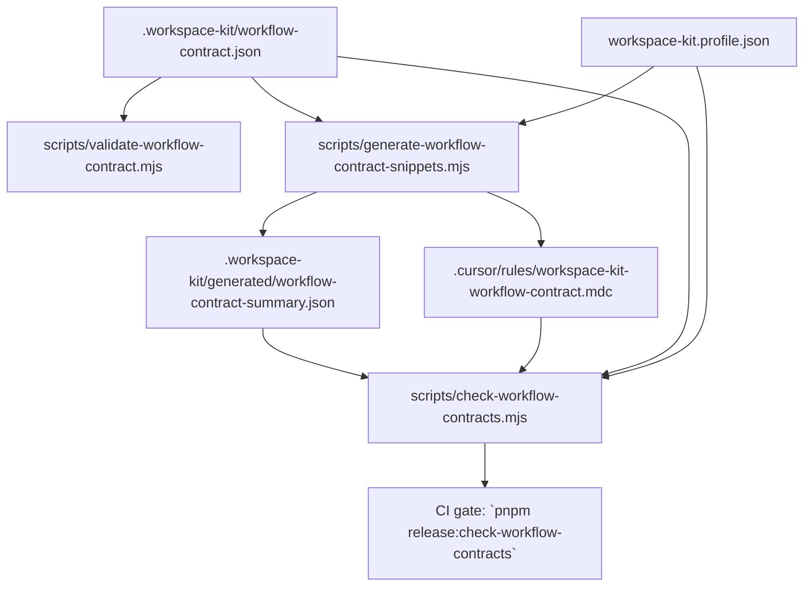

# Workspace Kit workflow-contract source of truth

This document is the canonical maintainer reference for Phase 4 workflow-contract-in-data.

## Canonical data and generated outputs

- Contract schema: `schemas/workspace-kit-workflow-contract.schema.json`
- Contract data: `.workspace-kit/workflow-contract.json`
- Generator: `scripts/generate-workflow-contract-snippets.mjs`
- Validator: `scripts/validate-workflow-contract.mjs`
- Generated summary: `.workspace-kit/generated/workflow-contract-summary.json`
- Generated rule snippet: `.cursor/rules/workspace-kit-workflow-contract.mdc`
- Contract drift gate: `scripts/check-workflow-contracts.mjs` (`pnpm release:check-workflow-contracts`)

## Single-source contract flow

## Maintainer commands

1. Regenerate snippets after contract/profile edits:
   - `pnpm workspace-kit:generate-workflow-contract-snippets`
2. Validate contract structure:
   - `pnpm workspace-kit:validate-workflow-contract`
3. Validate end-to-end coherence and drift checks:
   - `pnpm release:check-workflow-contracts`
